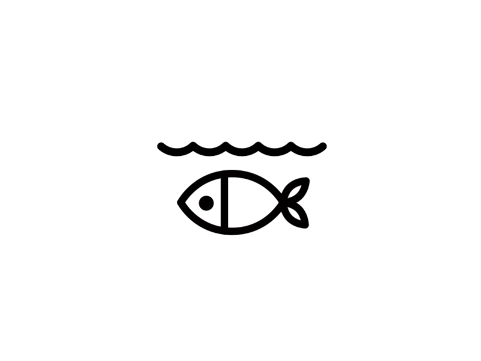

# About Me
*My name is Vy Pham. I'm a junior studying 6-3, and I spent the summer in Singapore researching AI in Genomics.*

Some fun facts about me:
1. I tripled the number of countries I've visited this year.
2. I love listening to borderline-annoying music.
3. I visualize the days of the week as a counter clockwise cycle.

# Table of Contents
* [Assignment 1](assignments/assignment1.md)
* [Problem Set 1](psets/ps1.md)
